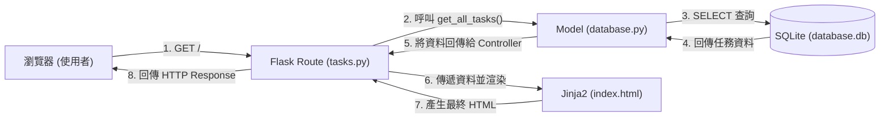

# 系統架構設計 (System Architecture)

## 1. 技術架構說明

本專案採用 Python + Flask 作為後端輕量級框架，以 Jinja2 作為前端模板引擎，並使用 SQLite 作為本機資料庫。
由於本專案主要需求是網頁上的表單提交與列表呈現，且強調快速開發與簡單部署，因此我們暫不採用前後端分離架構，而是讓 Flask 處理所有路由邏輯並直接回傳由 Jinja2 渲染好的 HTML 頁面。

**Flask MVC 模式說明：**
- **Model (資料模型)**：負責與 SQLite 資料庫溝通，處理資料的存取、新增、修改與刪除 (CRUD)。
- **View (視圖)**：Jinja2 模板檔案，負責將後端傳來的資料結合 HTML/CSS，渲染成使用者可看見的網頁畫面。
- **Controller (控制器)**：Flask 的路由函式 (Routes)，負責接收使用者的 HTTP 請求 (如 GET/POST 表單)，呼叫對應的 Model 處理資料，最後決定要回傳哪個 View (模板) 或是重新導向。

## 2. 專案資料夾結構

本專案預計使用以下資料夾結構來組織程式碼：

```text
app/
│
├── models/             ← 資料庫模型層
│   └── database.py     ← 負責資料庫連線、初始化與 CRUD 函式
│
├── routes/             ← 控制器層 (Flask Routes)
│   ├── auth.py         ← 處理註冊、登入等驗證路由
│   └── tasks.py        ← 處理新增、編輯、刪除任務等核心路由
│
├── templates/          ← 視圖層 (Jinja2 HTML 模板)
│   ├── base.html       ← 共用的版型骨架 (含導覽列、頁腳)
│   ├── index.html      ← 首頁 (任務列表)
│   ├── login.html      ← 登入頁面
│   └── register.html   ← 註冊頁面
│
└── static/             ← 靜態資源 (CSS, JS, 圖片)
    ├── css/
    │   └── style.css   ← 全局樣式
    └── js/
        └── main.js     ← 共用前端邏輯 (提示訊息、簡易驗證等)

instance/
└── database.db         ← SQLite 資料庫儲存位置

app.py                  ← 專案入口點設定 (建立與啟動 Flask 應用)
requirements.txt        ← 記錄 Python 套件依賴
README.md               ← 專案說明文件
```

## 3. 元件關係圖

以下展示各元件在一個典型請求中的互動流程（以讀取任務列表為例）：



## 4. 關鍵設計決策

1. **伺服器端渲染 (SSR)**：選用 Flask + Jinja2 渲染 HTML 而非 React 或 Vue 等前端框架，能夠減少初期架構複雜度與 API 層的開發成本，適合快速驗證任務管理 MVP 核心功能。
2. **輕量級資料庫配置**：採用 SQLite 作為資料庫，將資料儲存於單一 `.db` 檔案中，免去架設獨立資料庫伺服器的麻煩，非常適合輕量專案。
3. **分層架構 (MVC)**：將路由 (`routes`)、模板 (`templates`) 與資料庫操作 (`models`) 拆分至不同資料夾中，不僅提高程式碼可讀性，未來如果要擴充或重構也更容易維護。
4. **模組化路由 (Blueprints)**：我們在 `routes` 資料夾內拆分 `auth.py` 與 `tasks.py`，未來將透過 Flask Blueprint 將其組合回主程式，避免 `app.py` 因為專案成長而變得異常龐大。
