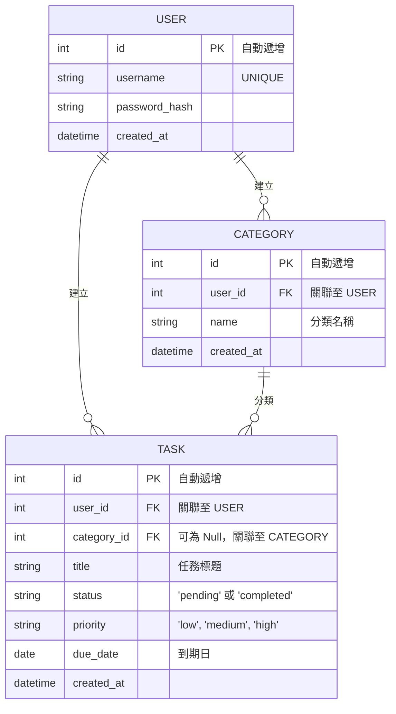

# 資料庫設計 (Database Design)

## 1. 實體關係圖 (ER_Diagram)

## 2. 資料表詳細說明

### `users` 表格
儲存使用者的基本驗證資訊。
- `id` (INTEGER): 主鍵，自動遞增。
- `username` (TEXT): 使用者名稱，必須為唯一值，必填。
- `password_hash` (TEXT): 經過雜湊處理的密碼，必填。防止密碼明文外洩。
- `created_at` (DATETIME): 帳號建立時間，預設為當下時間。

### `categories` 表格
儲存使用者自訂的任務分類標籤，作為「Should Have」功能的支援。
- `id` (INTEGER): 主鍵，自動遞增。
- `user_id` (INTEGER): 外鍵，關聯至 `users.id`，必填 (Cascade 刪除使用者時一起被刪)。
- `name` (TEXT): 分類名稱（如：工作、學習、私人）。
- `created_at` (DATETIME): 分類建立時間。

### `tasks` 表格
系統核心資料庫，儲存每個任務的細節。
- `id` (INTEGER): 主鍵，自動遞增。
- `user_id` (INTEGER): 外鍵，關聯至 `users.id`，必填，確保任務與使用者關聯。
- `category_id` (INTEGER): 外鍵，關聯至 `categories.id`，非必填。
- `title` (TEXT): 任務標題，必填。
- `status` (TEXT): 任務狀態，預設為 `'pending'`，將來可更新為 `'completed'`。
- `priority` (TEXT): 任務優先級預設為 `'medium'`。
- `due_date` (DATE): 任務截止日期，存 ISO 日期字串，非必填。
- `created_at` (DATETIME): 任務建立時間。
