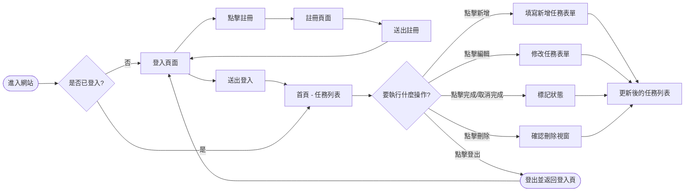
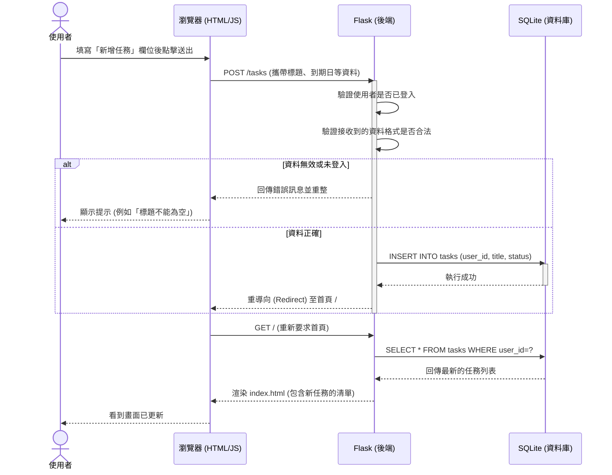

# 流程圖 (Flowcharts)

## 1. 使用者流程圖 (User Flow)
這張圖展示了使用者在系統中可能的操作路徑。由進入首頁開始，進行註冊、登入，以及登入後的各項任務管理操作。

## 2. 系統序列圖 (Sequence Diagram)
這張序列圖描述了以「新增任務」為例時，使用者、前端介面、後端路由與資料庫之間的詳細互動過程。

## 3. 功能清單對照表

每個主要功能所對應的 URL 路徑與 HTTP 方法整理如下：

| 功能名稱 | HTTP 方法 | URL 路徑 | Controller / Route 說明 |
| --- | --- | --- | --- |
| 顯示登入頁面 | GET | `/login` | 渲染 `login.html` |
| 處理使用者登入 | POST | `/login` | 驗證帳密，成功則寫入 Session 並重導向回首頁 |
| 顯示註冊頁面 | GET | `/register` | 渲染 `register.html` |
| 處理使用者註冊 | POST | `/register` | 建立新帳號，重導向至登入頁 |
| 顯示首頁/任務列表| GET | `/` | 驗證登入狀態，渲染 `index.html` 帶入任務資料 |
| 處理新增任務 | POST | `/tasks` | 接收表單資料存入資料庫，並重導向至 `/` |
| 處理更新任務狀態 | POST | `/tasks/<id>/toggle` | 切換對應的任務狀態 (完成/未完成) |
| 處理編輯任務 | POST | `/tasks/<id>/edit` | 更新對應的任務資訊 |
| 處理刪除任務 | POST | `/tasks/<id>/delete` | 從資料庫刪除對應的任務 |
| 處理登出 | GET | `/logout` | 清除 Session 並導向登入頁面 |
